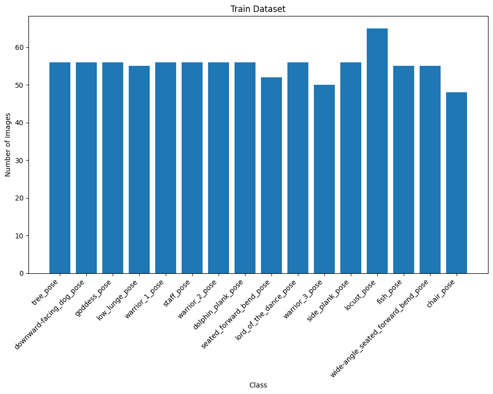
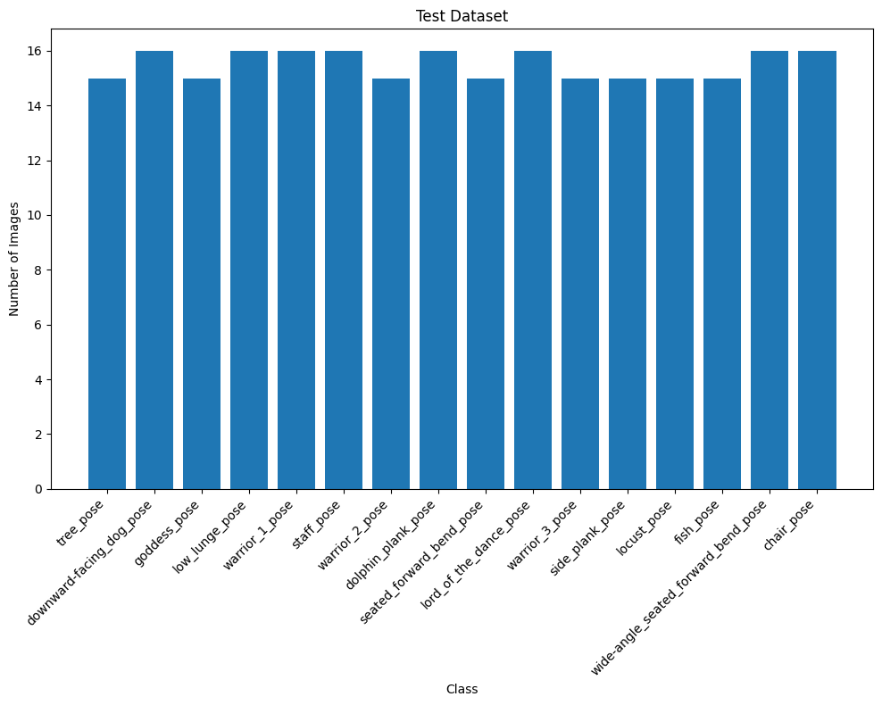

# Yoga Pose Classification

This project focuses on classifying yoga poses into 16 categories using deep learning models. We explore the use of a custom Convolutional Neural Network (CNN), ResNet50, and MobileNet for this classification task. The dataset consists of labeled images of yoga poses, and the goal is to train models to accurately categorize these poses.

## Table of Contents
- [Dataset](#dataset)
- [Dependencies](#dependencies)
- [Model Architecture](#model-architecture)
- [Training](#training)
- [Evaluation](#evaluation)
- [Results](#results)
- [License](#license)

## Dataset

The dataset contains images categorized into 16 yoga poses. It is split into:

- **Training Set:** 884 images
- **Validation Set:** 127 images
- **Test Set:** 248 images

The class distribution is visualized using bar plots to ensure the dataset is balanced.

**Label Distribution - Training Set**

**Label Distribution - Test Set**

**Label Distribution - Validation Set**

## Dependencies

- Python 3.7+
- PyTorch
- Torchvision
- Matplotlib
- Plotly

## Model Architecture
- **Custom CNN**: A deep CNN with 4 convolutional layers followed by max-pooling and 5 fully connected layers, utilizing dropout for regularization.

- **ResNet50**: A pretrained ResNet50 model with fine-tuning on the final layer for the yoga pose classification task.

- **MobileNet**: A pretrained MobileNet model with fine-tuning on the final layer.

## Training
- Batch size: 32
- Epochs: 12
- Using the Adam optimizer with a learning rate scheduler.

**Example of One Batch in the Training Data**:

## Evaluation
Models are evaluated on the test set. Performance metrics such as accuracy and loss curves are plotted to assess and compare the effectiveness of each model.

## Results
- CNN Test Accuracy: ~55.24%
- ResNet50 Test Accuracy: ~72.18%
- MobileNet Test Accuracy: ~70.97%

